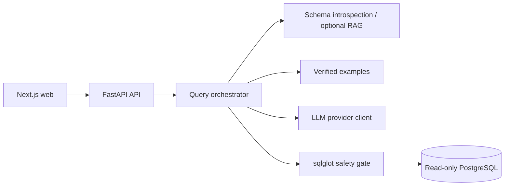
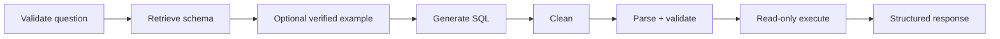

# QueryMindAI
> Ask questions, not SQL.

QueryMindAI is an open-source natural-language analytics platform that converts business questions into safe, explainable SQL queries over structured data.

## Current status

QueryMindAI is an early production-minded release. Implemented today: PostgreSQL schema introspection, optional schema-vector retrieval, provider-based SQL generation, parser validation, read-only execution, verified-example retrieval, query history, demo data, Docker Compose, and Render configuration. Authentication, multi-tenant credential storage, a polished connection manager, and comparative model benchmarks are roadmap items. Some retained dashboard views are explicitly demo UI.

## Screenshots


## Core capabilities and differentiators

- Schema-aware generation using live introspection, with optional pgvector retrieval.
- Exactly-one-statement PostgreSQL parsing and read-only enforcement through `sqlglot`.
- Transparent Generated SQL, explanation, warnings, limits, timeout, and request metadata.
- Semantic retrieval of human-verified prompt/SQL examples—no training or fine-tuning claim.
- A deterministic evaluation foundation that requires no paid API.
- PostgreSQL, Docker-based local development, and a single-repository Render Blueprint.

## Architecture



### Query lifecycle



## Tech stack

FastAPI, SQLAlchemy, Alembic, PostgreSQL/pgvector, sqlglot, OpenAI-compatible provider API, Next.js 15, React 19, TypeScript, Tailwind CSS, Docker Compose, GitHub Actions, and Render.

## Repository structure

```text
apps/api       FastAPI service, migrations, scripts, tests
apps/web       Next.js application
docs           Architecture, deployment, and security guidance
evaluations    Small deterministic dataset and runner
scripts        Operator helpers
.github        CI and issue templates
```

## Quickstart

Prerequisites: Python 3.12, Node 20, PostgreSQL 16 with pgvector, and optionally Ollama.

```bash
cp apps/api/.env.example apps/api/.env
cd apps/api
python -m venv .venv && source .venv/bin/activate
pip install -r requirements.txt
alembic upgrade head
psql "$DATABASE_URL" -f scripts/seed_data.sql
uvicorn app.main:app --reload --port 8000
```

In a second terminal:

```bash
cp apps/web/.env.example apps/web/.env.local
cd apps/web
npm ci
npm run dev
```

Open `http://localhost:4028`.

## Docker quickstart

The default stack runs PostgreSQL, API, and web. Because no LLM is bundled by default, configure a reachable remote provider or use the Ollama profile.

```bash
docker compose up --build
docker compose --profile ollama up --build
docker compose exec ollama ollama pull sqlcoder
```

For the default Compose stack, optional vector features are off so schema introspection still works; generation requires a configured provider. Set feature flags to `true` after installing the embedding model and seeding embeddings.

## Environment variables

| Variable | Purpose |
|---|---|
| `DATABASE_URL` | Application/demo PostgreSQL URL |
| `LLM_PROVIDER` | `ollama`, `groq`, or `openai` |
| `LLM_BASE_URL` | OpenAI-compatible API base URL |
| `LLM_API_KEY` | Provider secret; never commit it |
| `LLM_MODEL`, `LLM_FALLBACK_MODEL` | Primary and retry fallback generation models |
| `EMBEDDING_PROVIDER`, `EMBEDDING_MODEL` | Local semantic-retrieval configuration |
| `ENABLE_SCHEMA_RAG`, `ENABLE_GOLDEN_RECORDS` | Optional embedding features |
| `ENABLE_EXTERNAL_CONNECTIONS` | Raw connection endpoint; defaults false |
| `MAX_QUERY_ROWS`, `STATEMENT_TIMEOUT_MS` | Execution safeguards |
| `NEXT_PUBLIC_API_URL` | Browser-visible API `/api/v1` URL |

See the component `.env.example` files for all defaults.

## Provider setup

For local Ollama use `LLM_BASE_URL=http://ollama:11434/v1` in Compose (or `http://localhost:11434/v1` when the API runs directly), `LLM_API_KEY=ollama`, and `LLM_MODEL=sqlcoder`. Render defaults to Groq with `openai/gpt-oss-120b` and the configurable `llama-3.3-70b-versatile` fallback; enter `LLM_API_KEY` only in Render's secret environment field. Generation uses temperature zero, structured JSON, at most two retries, jittered exponential backoff, and fallback only for retryable provider errors.

Semantic retrieval uses lazy, process-cached `sentence-transformers/all-MiniLM-L6-v2` embeddings and never sends embedding inputs to Groq. Install `apps/api/requirements-embeddings.txt` only when enabling schema RAG or verified examples; both are disabled by default.

## API overview

- `GET /health`, `GET /ready`
- `GET /api/v1/schema`, `GET /api/v1/query-history`
- `POST /api/v1/query`
- `POST /api/v1/verified-examples`
- `POST /api/v1/connect-and-query` (disabled by default)

Interactive OpenAPI documentation is at `/docs`.

## Safety and correctness model

The API validates question size, limits generated SQL length, rejects comments/multiple statements, parses PostgreSQL SQL, permits only read-only query trees, caps rows, applies a statement timeout, and starts a read-only transaction before executing. Deploy with the separate read-only role described in [security guidance](docs/security.md); application checks are defense in depth, not a substitute for database permissions.

## Evaluation approach

`python evaluations/runner.py` performs deterministic parser, table, limit, latency, and unsafe-query checks. The dataset includes reference SQL and never calls a paid LLM. Semantic equivalence and live execution scoring remain intentionally small roadmap work.

## Render deployment

`render.yaml` defines the API, web app, and PostgreSQL database. Secrets and the browser API URL require dashboard entry. Follow [the exact Blueprint procedure](docs/deployment.md); this repository prepares deployment but has not deployed or connected a Render account.

## Limitations and roadmap

Current limitations include PostgreSQL-only execution, provider-dependent SQL quality, unavailable verified-example saving when embeddings are disabled, no auth/multi-tenancy, no encrypted external credential vault, in-memory external schema cache, and demo-only management screens.

Roadmap: authenticated workspaces, secure connection management, API-backed connection pages, richer history review, execution-backed evaluations, additional SQL dialects, observability exports, and reviewed embedding lifecycle tools.

## Contributing and license

Read [CONTRIBUTING.md](CONTRIBUTING.md) and the [Code of Conduct](CODE_OF_CONDUCT.md). QueryMindAI is available under the [MIT License](LICENSE).
