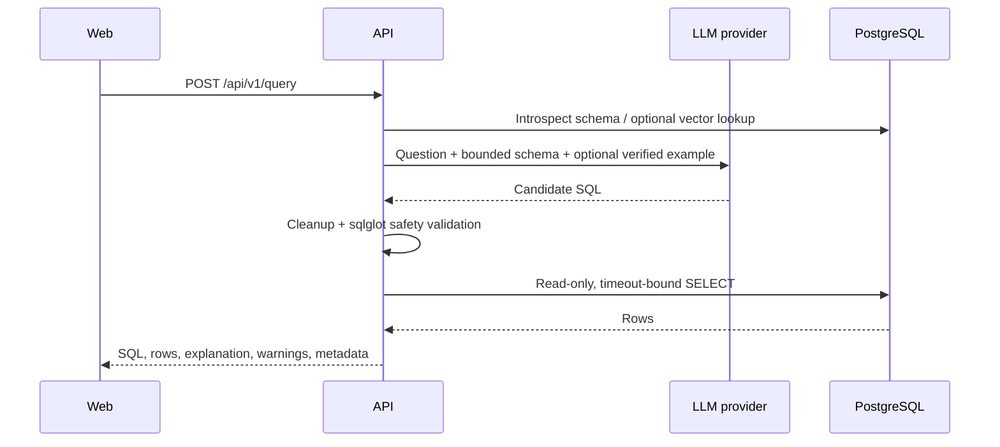

# Architecture

QueryMindAI is a two-service monorepo: a browser-rendered Next.js application and a modular FastAPI API backed by PostgreSQL/pgvector. The API is the trust boundary; the browser cannot execute SQL directly.

The provider is OpenAI API compatible and constructed once from settings. If embedding functionality fails, live schema introspection remains available and verified-example retrieval is skipped. Migrations, not app startup, own production schema changes. Query history is implemented as best-effort recording after successful execution.

Static frontend management surfaces were retained to avoid an unnecessary visual rewrite. Their datasets are demo presentation data; only the query assistant currently completes the product journey end to end.
