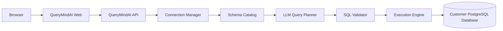

# Architecture

QueryMindAI remains a modular FastAPI monolith plus a Next.js web application. The API owns identity verification, credential encryption, catalog snapshots, planning, validation, execution, history, and audit records.

Connection creation normalizes URL or structured input, resolves and rejects unsafe addresses, tests SSL connectivity, introspects metadata, encrypts credentials, and stores a content-addressed snapshot. Credentials and row data never enter prompts.

Generation and execution are deliberately separate. Generation stores an owned, expiring draft after parser and catalog-table validation. Execution requires explicit browser action, verifies draft and connection ownership, reloads the current catalog, revalidates SQL immediately before execution, rechecks DNS, opens a fresh connection, starts a read-only transaction, applies a timeout, caps results, and rolls back. History stores SQL and metadata, not result rows.

Signed anonymous workspace sessions are the current minimal identity boundary. They protect ownership from forged identifiers but are browser-local and are not user accounts. Replace the `auth` module with verified OIDC/JWT identity for multi-user production deployments.
